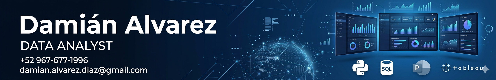
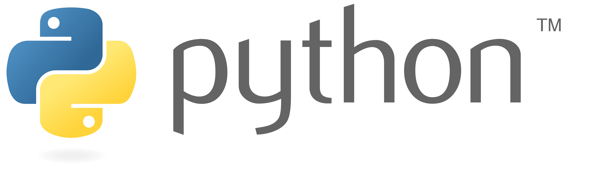
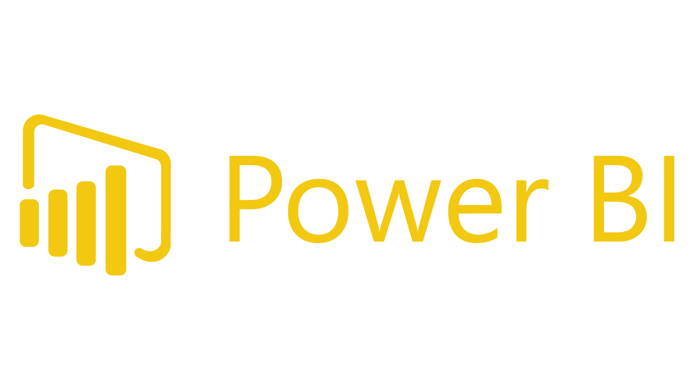
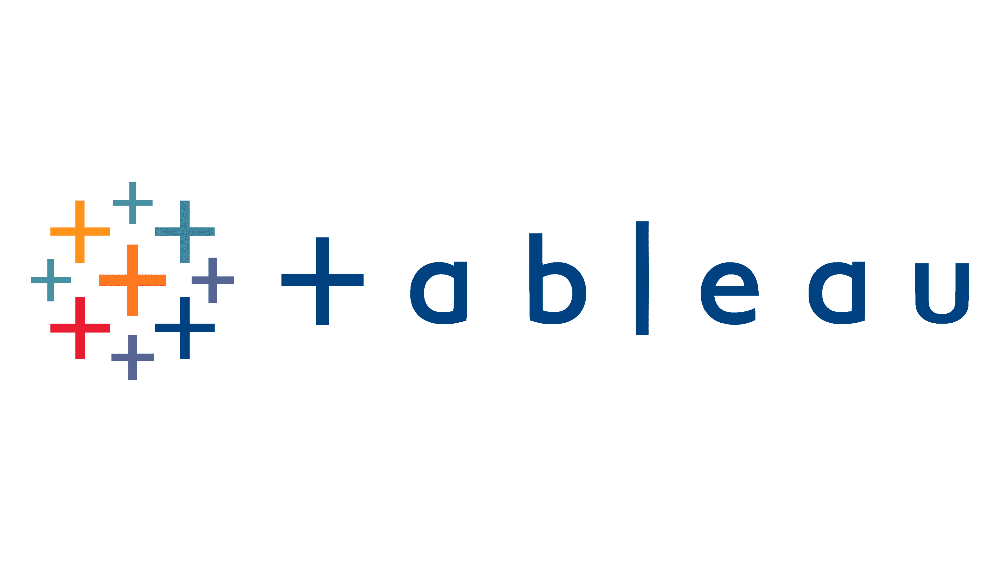

  

## ES Español (view English version below)

<h1 align="center">
  ¡Hola! Soy Damián Alvarez, analista de datos
</h1>

---

### Me apasiona convertir datos en información útil y valiosa | Data Analytics | Python | SQL | Power BI | Tableau

Estoy comenzando formalmente en este fascinante mundo de **Data Analytics**, aplicando mis conocimientos y habilidades adquiridos en las Ciencias Sociales (mi primera carrera fue en Arqueología) a la interpretación y análisis de datos.

Mi meta es siempre convertir **datos crudos** y sin relevancia aparente en **información útil, estratégica y valiosa** que apoye y motive a la toma de descisiones informadas y sustentadas. Me gusta mucho utilizar herramientas como **Excel/GoogleSheets**, **Python**, **SQL**, **Power BI** y **Tableau** para generar **informes analíticos**, **visualizaciones** y **dashboards interactivos** que ayuden a las organizaciones a evaluarse y conseguir sus objetivos.

Actualmente estoy en la búsqueda de nuevos **retos profesionales** donde pueda aplicar mi pasión por el **Data Analytics**.

---

### Tecnologías que utilizo

  
  
  
  

---

### Aptitudes y habilidades

- **Análisis de Datos**
- **Generación de Insights**
- **Creación de dashboards y visualizaciones**   
- **Automatización de Procesos**   
- **Trabajo en equipo**
- **Resolución de problemas**  
- **Pensamiento crítico**  
- **Comunicación efectiva**  
- **Proactividad**

---

### Siempre aprendiendo

Me encanta mejorar las habilidades que ya tengo y adquirir nuevos conocimientos, procurando dominar **nuevas herramientas** y **métodos** para hacer más eficiente el análisis de datos. Actualmente estoy aumentando mi nivel de comprensión en **SQL** y **Python**, así como en herramientas de creación de dashboards interactivos

---

### Proyectos destacados

En mi perfil de GitHub encontrarás los diversos proyectos en los que he participado. Algunos de mis proyectos incluyen **Análisis de Datos con Python y SQL**, los cuales involucraron el análisis de grandes volúmenes de datos para obtener **información valiosa** y generar **informes predictivos**.

---

### ¿Quieres contactar conmigo?

Puedes encontrarme en [**LinkedIn**](https://www.linkedin.com/in/damianalvarez-dataanalyst).
O bien, escríbeme a damian.alvarez.diaz@gmail.com

---

### Conéctate conmigo en GitHub

Echa un vistazo a mis repositorios y proyectos y por favor, siéntete libre de enviarme sugerencias y retroalimentación, ya que eso me ayuda a mejorar y crecer profesionalmente. https://damianalvarezdiaz.github.io/portafolio_damian_alvarez/

---

### Más sobre mi...

Estudié **Arqueología** en la Universidad de Las Américas, Puebla, graduándome en 2009 y participando activamente en trabajo de campo (excavaciones) e investigación en varios sitios mexicanos con diferentes instituciones como Harvard University (EEUU), Aichi Prefectural University (Japón), Centre National de la Recherche Scientifique (Francia) y el Instituto Nacional de Antropología e Historia (México), entre otros. En esos años aprendí mucho sobre **pensamiento científico**, **diseño y gestión de proyectos y presupuestos**, **trabajo en equipo y negociación con distintos segmentos sociales** y **generación de información a partir de datos**.
Posteriormente, la vida me llevó al mundo del turismo, donde utilicé todos los conocimientos sobre historia, antropología, cultura, arqueología y demás, para laborar como guía de turistas, teniendo la oportunidad de conocer gran parte del país y agregando nuevas habilidades como **manejo y resolución de conflictos**, **administración y diseño de rutas y grupos**, **toma de decisiones** y muchas más.
Actualmente, mis curiosidades van hacia el mundo de la tecnología y en 2025 concluí mi segunda carrera en la Universidad Tecnológica de México, ahora en **Ingeniería de Software y Redes**, donde una de las materias que más llamó mi atención fue la relacionada con **bases de datos** y su posterior **análisis e interpretación**, por lo que me preparé más en esta área a través de un Bootcamp en TripleTen sobre **Data Analytics** y ahora pienso explorar más a fondo las posibilidades de este campo.

US English

<h1 align="center">
  Hello!, I'm Damian Alvarez, Data Analyst
</h1>

---

### Engaged in turning data into valuable and usefull information | Data Analytics | Python | SQL | Power BI | Tableau

I´m just beginning formally in this fascinating world of **Data Analytics**, incorporating my abilities and knowledge in Social Science (my first degree is as an Archaeologist) into data analysis and interpretation.
My target is always to turn **raw data** without obvious relevant value into **strategic, usefull and valuable information** that supports and encourages decision-taking. I like to employ tools like **Excel/GoogleSheets**, **Python**, **SQL**, **Power BI** y **Tableau** in order to produce **analytical reports**, **visualizations** and **interactive dashboards** that help organizations to measure themselves and achieve their goals. 
I´m currently looking for new **proffessional challenges** where I can practice my passion for **Data Analytics**.

---

### Technologies I use

  
  
  
  

---

### Skills and abilities

- **Data Analysis**
- **Insight production**
- **Dashboard and visualizations design**
- **Process Automation**
- **Teamwork**
- **Troubleshooting**  
- **Critical thinking** 
- **Effective communication**  
- **Proactivity**

---

### Always learning

I enjoy improving the skills that I have already achieved and get new knowledge, dominating **new tools** and **methods** to provide more efficient data analyses. I´m currently learning deeply abput **SQL** and **Python**, as well as on dashboard and visualization softwares. 

---

### Featured projects

On my GitHub profile, you can explore a variety of projects I have developed, which include **Data Analysis with Python and SQL**, where large volumes of data has been analysed in order to retrieve **valuable information**.

---
### Would you like to contact me?

Find me on [**LinkedIn**](https://www.linkedin.com/in/damianalvarez-dataanalyst).
Or send me an email at damian.alvarez.diaz@gmail.com

---

### Connect with me on GitHub

Take a look to my repositories and projects and please, feel free to send me your suggestions and feedback, which I appreciate in order to grow and improve proffessionally. https://damianalvarezdiaz.github.io/portafolio_damian_alvarez/

---

### More about me...
I studied **Archaeology** at Universidad de Las Américas, Puebla, getting my degree in 2009 and actively participating on field work (diggings) and research at different sites in Mexico with several institutions like Harvard University (USA), Aichi Prefectural University (Japan), Centre National de la Recherche Scientifique (France) and the National Institute of History and Antrhopology (Mexico), among others. During those years, I learned a lot about **scientific reasoning**, **project and budget design and management**, **teamwork and negotiating with several and different social segments** and **providing information from raw data**.
Afterwards, life took me to the world of tourism, where I employed all my knowldege about History, Antrhopology, Culture, Archaeology , and others, to work as a tour-guide, having the opportunity to travel throughout most of the country and adding new skills like **troubleshooting**, **group management**, **decision-taking** among others.
Currently, my curiosity points towards technology, and in 2025 I finished my secong university degree at Universidad Tecnológica de México, now as a **Software and Network Engineer**, where one of my favorite courses was related to **Databases** and the further **Analysis and interpretation**, so, I learned deeply into this field and I finished a Bootcamp at TripleTen about **Data Analytics** and now I´m really looking forward to explore in more detail the possibilities of this area. 

Feel free to explore my repositories and projects. If you have any suggestions or feedback, I'd love to hear them! I'm always looking to improve my skills and learn from other developers. https://guillermoteran.github.io/Portafolio-de-proye
